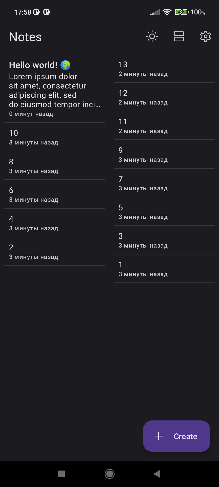
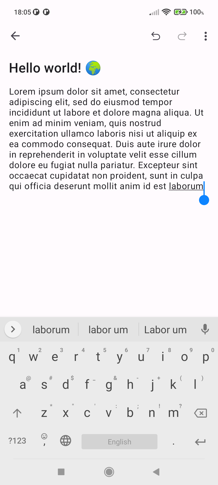

# Notes

Open source Notes app for Android. Yes, another one, I know.

Originally developed to improve my Android development skills. As a result, it utilizes modern app development methodologies such as Single Activity, MVVM, LiveData, Room, Navigation components, etc.

## Features

- Light/Dark theme
- List/Grid display modes
- Undo/Redo while editing a note (only for the current session)
- Biometric authentication (can be enabled in settings)

## Contribution

Feel free to make improvements and fixes. Just stick with the KISS (keep it short and simple) principle.

## Credits

Icons by Google from [Material Symbols Library](http://fonts.google.com/icons). 